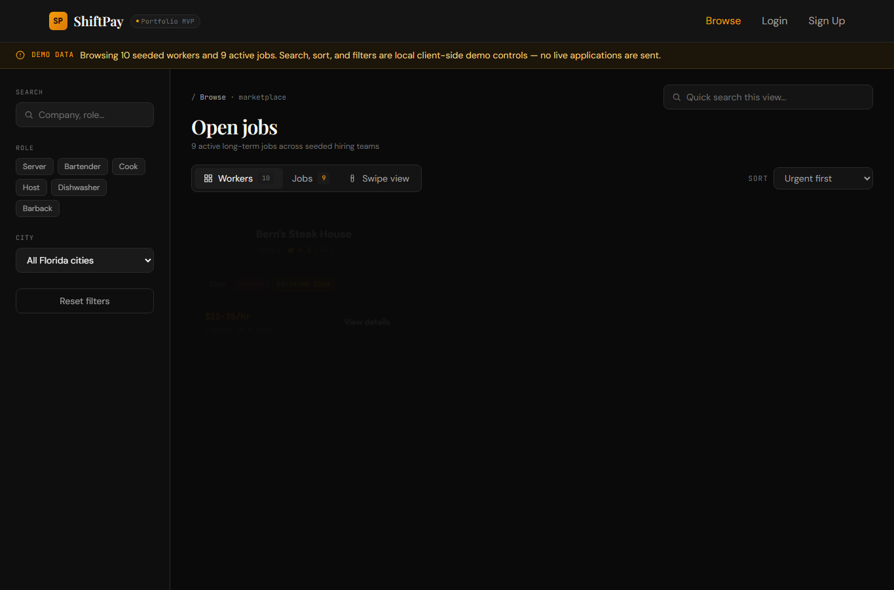
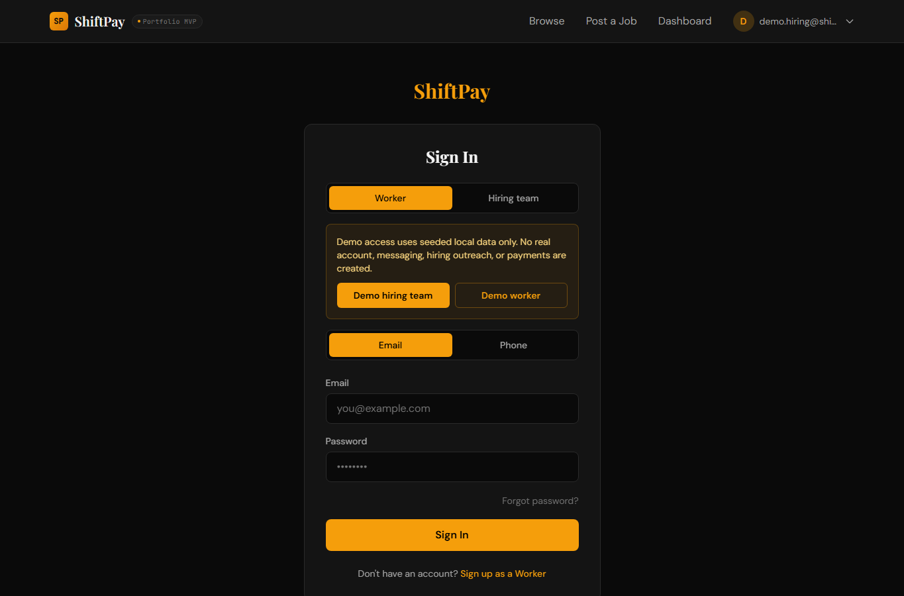
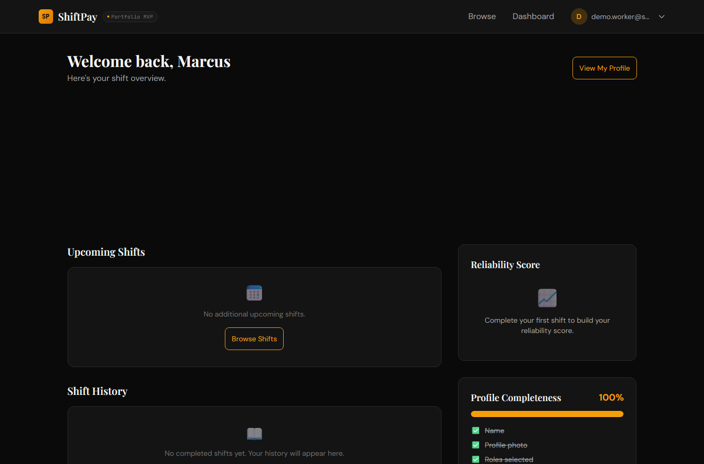

# ShiftPay

ShiftPay is a portfolio MVP for hospitality hiring teams and workers. The demo focuses on long-term job postings first, with event-shift coverage available for banquet, catering, pop-up, and similar staffing needs.

The app is built for fast GitHub review: React 19, Vite 7, Tailwind CSS 4, React Router 7, mock-data fallback, Supabase-ready data access, and Playwright coverage.

## Screenshots







## Demo Flow

1. Run the app and open `http://localhost:3000`.
2. Use `Login -> Demo hiring team` to review active jobs, local reminder states, renew, close, and repost flows.
3. Use `Login -> Demo worker` to review the worker dashboard.
4. Open `/browse` to switch between worker discovery and open jobs, or use `/swipe` for the card-style worker discovery view.

The local demo does not create real accounts, send messages, process payments, or contact workers.

## What This Demonstrates

- Jobs-first marketplace browse experience with worker and job tabs.
- Hiring-team dashboard for long-term jobs, event shifts, posting states, and repost flows.
- Worker dashboard with profile completeness, reliability, upcoming work, and review history.
- Multi-step onboarding for workers and hiring teams with local form persistence.
- API adapter pattern that lets public read flows fall back to seeded data when Supabase is not configured.
- Responsive Tailwind CSS 4 interface with design tokens in `src/index.css`.
- Playwright route and workflow coverage for the main demo paths.

## Tech Stack

| Area | Tools |
| --- | --- |
| Frontend | React 19, Vite 7, React Router 7 |
| Styling | Tailwind CSS 4, custom theme tokens |
| Data/Auth Shape | Supabase client, Postgres migrations, RLS policies, edge function examples |
| Demo Data | Mock JSON arrays with local state for review flows |
| Testing | ESLint, Playwright |

## Product Scope

ShiftPay models two account types:

- **Workers** create profiles with roles, availability, certifications, rates, and experience.
- **Hiring teams** create company profiles, post long-term jobs, optionally post event shifts, and manage posting visibility.

This repository is a public portfolio build. Backend operations, real outreach, real billing, production monitoring, and launch runbooks are intentionally outside the public demo scope.

## Getting Started

### Prerequisites

- Node.js 18+
- npm

### Install

```bash
npm install
```

### Environment

Create `.env.local` from the example file:

```bash
cp .env.example .env.local
```

For local review, keep `VITE_FORCE_MOCK_DATA=true`. The app will use seeded data for public routes without requiring private infrastructure.

### Run Locally

```bash
npm run dev
```

Open `http://localhost:3000`.

### Verify

```bash
npm run lint
npm run build
npm run test:e2e
```

## Useful Routes

| Route | Purpose |
| --- | --- |
| `/` | Portfolio landing page |
| `/browse` | Worker and job marketplace |
| `/swipe` | Card-style worker discovery |
| `/login` | Login plus demo worker and demo hiring-team access |
| `/hiring/signup` | Hiring-team onboarding |
| `/worker/signup` | Worker onboarding |
| `/dashboard/hiring` | Hiring-team dashboard |
| `/dashboard/worker` | Worker dashboard |
| `/post-job` | Long-term job and event-shift posting flow |
| `/company/:id` | Public company profile |
| `/jobs/:id` | Event-shift detail route |

## Repository Structure

```text
src/
  components/        Reusable UI primitives and cards
  contexts/          Auth provider and context value
  data/              Seeded demo data
  hooks/             Data, auth, form, and filter hooks
  lib/               Supabase client and API adapter
  pages/             Route-level React views
  utils/             Shared constants and posting lifecycle helpers
supabase/
  functions/         Edge function examples
  migrations/        Database schema, RLS policies, and RPC examples
tests/               Playwright route and flow coverage
```

The current storage schema still uses legacy `restaurants` and `shifts` names in a few places while the public UI presents hiring-team, company, job, and event-shift language.

## Public Portfolio Boundary

The public repository is intended to show product thinking, UI execution, React architecture, and test coverage. Detailed planning notes, private operating notes, and launch-specific runbooks are not included in the public branch.

## License

All rights reserved. See [LICENSE](LICENSE).
